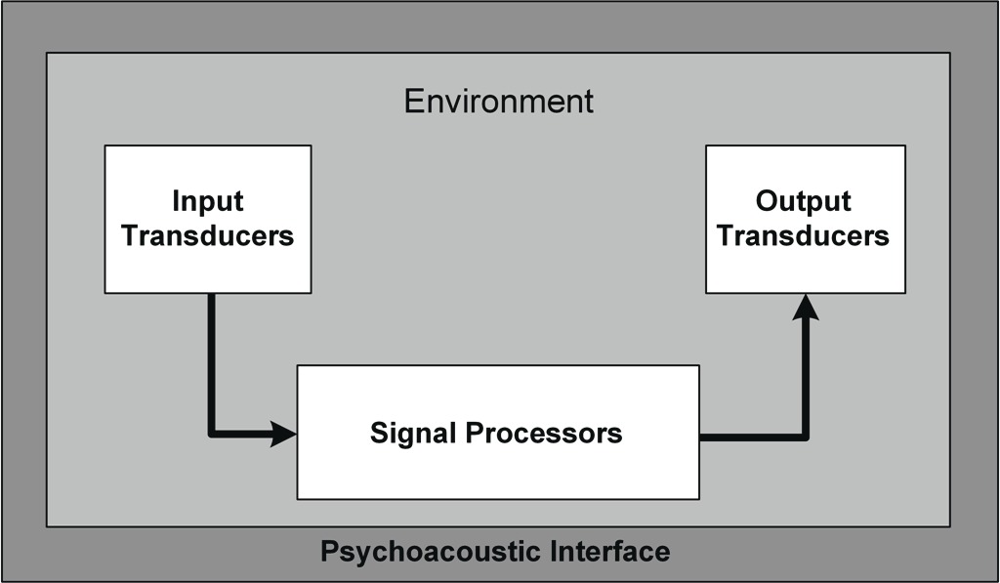
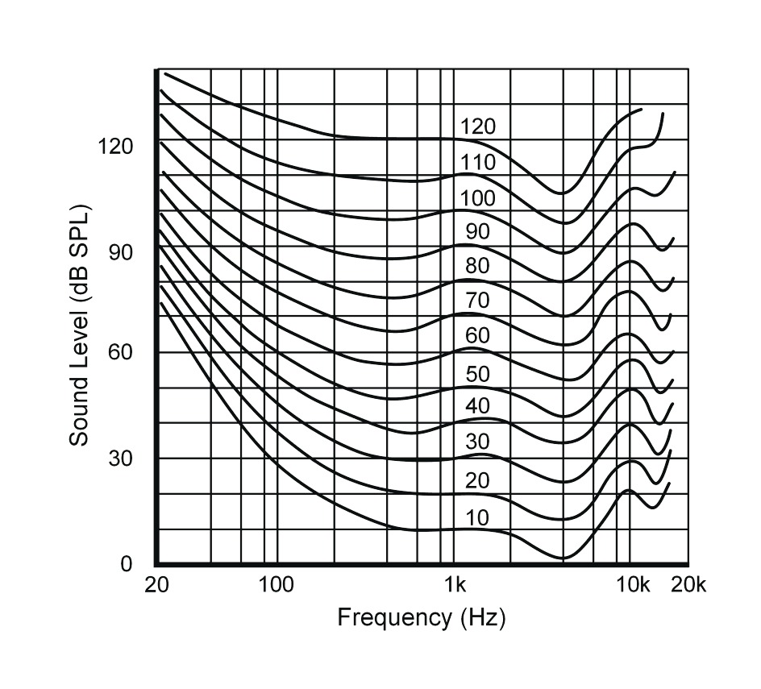
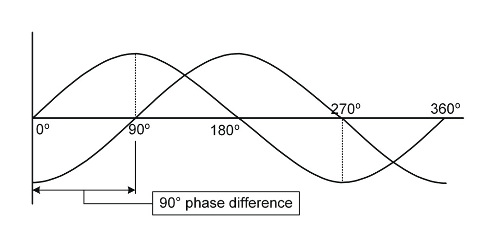
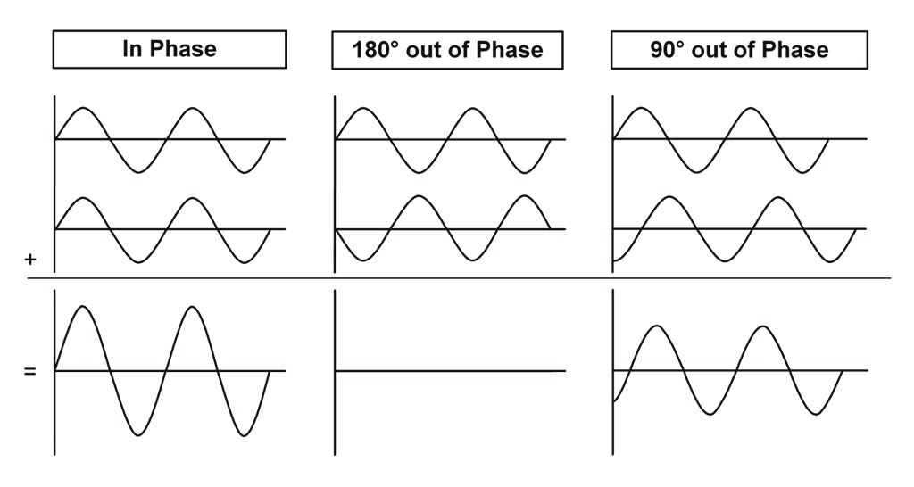

# Sound Reinforcement Basics

## Purpose of Sound Reinforcement System

Author presents these basic four requirements of a sound reinforcement system

 - Intelligibility
 - Fidelity
 - Power
 - Monitoring and Controllability

##  Simplified Purpose of Sound Reinforcement System

I tend to simplify the four requirements into just two:

 - Fidelity
 - Power

## Fidelity (Includes Intelligibility)
  Fidelity is the ability of the sound reinforcement system to recreate a sound accurately.  I believe this is going to include inteligibility, or the ability to understand what is being spoken.  If you have a high fidelity sound system, you should also be able to clearly understand what is said.

## Power
  The sound system needs to be able to produce a level of output high enough for it's needs.
   - Rock and Roll == Higher Power Required
   - Speech Reinforcement == Lower Power Requirements

## Why not monitoring and control?
  Some sound systems are designed in such a way that their operators are completely unaware of what is actually happening.  These are commonly installed in commercial and some house of worship situations, where the operator needs to just hit a button to turn things on, and know that it will do what they want.

## Sound Reinforcement System Model

 1. Psychoacoustics
 2. Environment
 3. Input Transducers
 4. Signal Processing
 5. Output Transducers

And we are going to add *interconnections* to this list.

## Psychoacoustics

Psychoacoustics has to do with how we hear.  We do not hear linearly, and various factors can change how we hear a sound.

## Environment

The environment is where we physically hear the sound.  If it is a noisy environment, it will affect how we hear the sound and the power needed to overcome the noise to hear the sound clearly.

## Input Transducers

Input Transducer: Converts Acoustic Energy into Electrical Energy

Examples: Microphones, Pickups, etc.

## Signal Processing

Signal Processing: Anything that affects the quality of the electrical signal representing the acoustic sounds.

Examples: Mixers, FX Processors, Dynamics (Compressor/Expander), etc.

## Output Transducers

Output Transducers: Converts electrical energy into Acoustic Energy

Examples: Speakers

## Interconnects

Interconnects: The cabling and signaling carried on it that connects the various pieces of equipment.

Examples: XLR Cable, Speaker Cables, TosLink Cables, etc.

## What is Sound?

Sound is the rapid repeated cycling of pressure from high to low pressure.  As humans we typically hear pressure changes in the air that cycle from 20 times a second to 20 thousands times a second as sound.

## Sound Terminology (1/3)

We use a 2 dimensional graph to show the changes in pressure over time as we stand still and a sound wave passes us.

## Sound Terminology (2/3)

 - Amplitude: The measured intensity of a sound wave (The difference between high and low pressure)
 - Wavelength: The distance it takes for a wave to complete one cycle
 - Period: The amount of time it takes for a wave to complete one cycle

## Sound Terminology (3/3)

 - Frequency: The number of cycles of a waveform each second
 - Compression: Area of high pressure
 - Rarefaction: Area of low pressure

## Decibel

 - Represents a logarithmic ratio of two numbers
 - Used due to the exponential nature of numbers we need for sound

## Decibel SPL

 - Represents the ratio between the quietest sound we can hear and a different sound intensity
 - Used to discuss the 'volume' of sound in air

## Inverse Square Law

 - Actually a misnomer, what we deal with is the inverse distance law, but is commonly called the inverse square law
 - Due to the way that sound expands in a space, we lose power as the sound wave 'stretches' to cover more area
 - For every doubling of distance, we are at 1/4 of the power
 - Or, for every doubling of distance we lose 6dBSPL

## Calculating Sound Loss over Distance

 - 20 * log(d2/d1) = Difference in Gain
 - So for a 90dBSPL source at 1 foot, the sound at 23ft is
  * 20 * log(23/1)
  * 20 * log(23)
  * 20 * 1.36172783602
  * 27.2345567204
  * 90 - 27.2345567204 is approx. equal to 63dBSPL at 23 ft

## Gain

 - Gain is a term that gets applied in multiple different ways in sound
 - It could refer to the total change in power when a sound goes through a sound system and is amplified
 - It could refer to the amplification of any signal at any one stage of this process
 - It could refer to the adjustment made to the input of a preamp (Also referred to as Trim)
 - All of these have a common similarity of referring to a change in level

## Equal Loudness Curves

 - The way we hear changes depending on the 'loudness' of the sound
 - At lower volumes we are more sensitive to the range of the human voice
 - At higher volumes our hearing becomes 'flatter'
 - Thus the 'loud' button on old stereos that would boost bass and high frequencies to make it sound louder

## Phase

 - From the book: Phase is a way of describing the relative time positions of two waves that have the same wavelength,
and hence, frequency
 - Since audio is cyclical, we used degrees to represent phase

## Constructive and Destructive Interference

 - When two wave forms add, they can add constructively or destructively
 - *Constructive Interference*: When the result of two wave forms adding is greater in amplitude than either original
 - *Destructive Interference*: When the result of two wave forms adding is weaker in amplitude than either original

## Speed of Sound

 - Approx. 340m/s
 - Rule of thumb for quick calculations and checking work, 1ft == 1ms
 
## Calculating Wavelength

& \frac{4/3} $

## Calculating Distance
## Doppler Effect
## Longitudinal vs Transverse Wave
## Mechanical vs Electromagnetic Wave

## Line Level vs Mic Level vs Speaker Level
