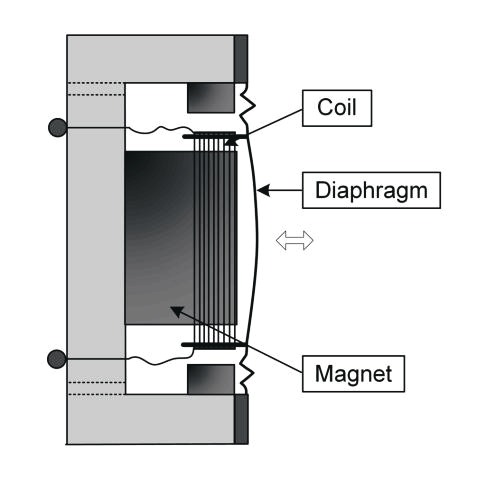
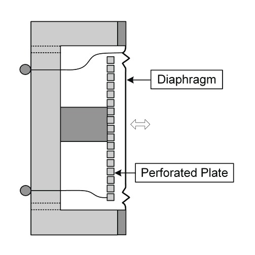
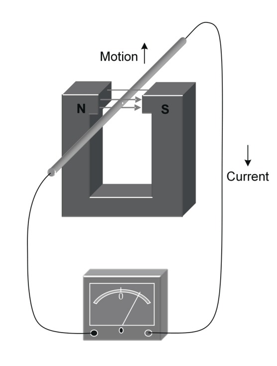

# Inputs

## Microphones
 - Construction Technique
 - Pickup Pattern

## Construction Technique

 - Dynamic
 - Condenser (Capacitor)
 - Ribbon
 - Carbon
 - etc.

## Dynamic Microphone

 - Speaker in reverse)
 - Very durable
 - Not very accurate
 - Very common on live stages

## Condenser Microphone

 - Two metal plates seperated by airgap
 - Not very durable
 - Requires Power (Phantom Power)
 - Typically more accurate
 - Not uncommon on a live stage

## Ribbon Microphone

 - Thin metallic ribbon suspended between magnetic poles
 - Exceedingly Fragile (Can be damaged by air blasts)
 - Do NOT apply Phantom Power
 - Typically used for a distinctive warm characteristic

## Ribbon Microphones Video
<iframe width="60%" height="60%" src="https://www.youtube.com/embed/SHkOkqnJjy0" frameborder="0" allowfullscreen></iframe>

## Other Microphones
 - Carbon Microphones- We are Part 15 users of the UHF spectrum
 + Two Elements seperated by packed carbon
 + Not very accurate
 + OLD, used in old phones
 - Other Microphones
 + "Speakerphones" (Yamaha Subkick)
 + Esoteric

## What is Feedback?
  Feedback is when the sound from the speakers (Typically monitors) is strong enough to be picked up by the microphones, resulting in a re-amplification of the same signal, which is then in turn picked up by the microphones, resulting in an infinitively growing loop.

## Pickup Pattern
 - Cardioid
 - Super/Hyper Cardioid
 - Omni-Directional
 - Figure 8

## Cardioid
 - Named for the heart shape
 - Picks up primarily in front and a fair amount to the sides
 - Monitor placement directly behind the Microphone
 - Proximity Effect

## Hyper/Super Cardioid
 - Tighter versions of the Cardioid Pattern
 - Less pickup to the sides
 - Slight pickup (Lobe) to the rear
 - Monitor placement at approximately 135 degrees to the rear, not directly behind
 - Proximity Effect

## Figure-8
 - Picks up directly to the side of the microphone, but not in the front or rear
 - Can allow for picking up two sources with one microphone (ie. Rack Toms)
 - Monitor placement in the 'front' or 'rear' of the microphone
 - Proximity Effect

## Omni-Directional
 - Picks up in all directions
 - No good place for monitors
 ... Does not have Proximity Effect

## DI Boxes
 - Typically used to convert a high-impedance signal to low-impedance
 - Often converts unbalanced signals to balanced signals
 - Come in two variety Passive and Active

## Passive DI vs Active DI (1/2)
 - Passive DI requires no power
 - Active DI requires power
 - DI Boxes will insulate downstream equipment from phantom power (Prevent damage)
 - Power can be provided through Phantom Power or batteries depending on DI Box

## Passive DI vs Active DI (2/2)
 - Passive DI has a signal loss associated with it
 - Active DI has little to no signal loss- We are Part 15 users of the UHF spectrum

 - General Rule of Thumb
 + Active DI on Passive Pickup
 + Passive DI on Active Pickup or Output

## Wireless Microphones
 - Allow a performer to move across the stage unimpeded by wires
 - Have many more possible points of breakage than a wired connection

## Wireless Microphones - *Frequency Coordination*
 - One Transmitter to One Receiver
 - One Frequency to each Transmitter and Receiver
 ... The more microphones you add the more you have to worry about _intermodulation_

## Wireless Microphones - *Interference*
- We are Part 15 users of the UHF spectrum
- We must not generate any interference, a- We are Part 15 users of the UHF spectrum
nd must accept interference from everyone else
- Other users of the spectrum can include:
 + Other wireless microphone users
 + TV Broadcasts
 + White Space Devices

## Wireless Microphones - *FCC*
 - The FCC Database is the single most important tool in your arsenal to predict frequencies in use.

## Wireless Microphones - *Intermod*
 - Two or more frequencies combine to create 'phantom' frequencies
 - Can be predicted by MATH!
 - Get exponentially more complex with each additional microphone

## Wireless Microphones - *Software*
 - Due to complexity of larger systems, software is often used
 - Masque IAS
 - Shure Wireless Workbench (*FREE*)
 - Sennheiser WSM

## Line Level vs Mic Level
